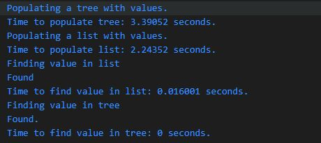

This repo is me for me practicing the implementation of an avl tree. We demonstrate bfs to output the tree, dfs in-order to clear the tree, and how to balance a tree using recursion.  
We also perform a simple time test comparing the insertion of a tree compared to a linked list, as well as the time it takes to find an element in each structure.  
